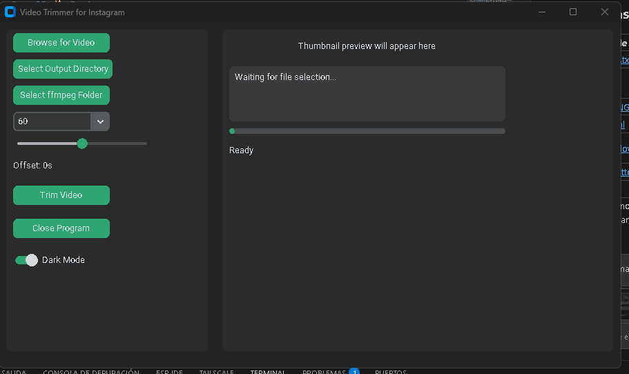
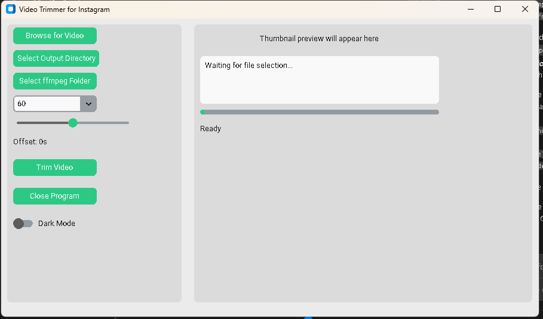

# InstaVideoSplitter

[](https://www.python.org/downloads/)
[](LICENSE)
[](https://github.com/EdwinKestler/instagramStoryParts/actions/workflows/ci.yml)


A desktop video trimming tool built with Python and CustomTkinter that splits long videos into Instagram Story-compatible segments. Cuts are aligned to keyframes so quality is preserved without full re-encoding.

---

## Screenshots

| Dark mode                              | Light mode                               |
| -------------------------------------- | ---------------------------------------- |
|  |  |

---

## Features

- GUI and CLI interfaces
- Any segment duration in seconds (15 / 30 / 60 / 90 common; fully configurable via CLI)
- Keyframe-aligned cuts — stream copy, no re-encoding
- Configurable parallel export workers (`-w`, GUI slider)
- Cut offset slider / flag: fine-tune every cut by ±5 seconds
- Short segments padded with black frames and silence
- Optional keep of a slightly-over-length last segment
- Video thumbnail preview and metadata display (resolution, fps, duration) in the GUI
- Live log output during processing via a dedicated log panel
- Dark / Light mode toggle
- Custom ffmpeg binary folder — GUI picker or `--ffmpeg-dir` flag or `FFMPEG_DIR` env var
- **CUDA / NVENC acceleration** — optional `h264_nvenc` encoder for re-encoding operations (`--cuda` flag or GUI checkbox)
- Cross-platform: Windows, macOS, Linux
- Pre-built binaries for Windows and Linux via GitHub Releases

---

## Requirements

- Python 3.10 or newer
- [ffmpeg](https://ffmpeg.org/download.html) — accessible on your system PATH, via `FFMPEG_DIR`, or set in the GUI

---

## Installation

```bash
# 1. Clone the repository
git clone https://github.com/EdwinKestler/instagramStoryParts.git
cd instagramStoryParts

# 2. Create and activate a virtual environment (recommended)
python -m venv .venv
# Windows
.venv\Scripts\activate
# macOS / Linux
source .venv/bin/activate

# 3. Install dependencies
pip install -r requirements.txt
```

---

## GUI Usage

```bash
python -m instavideosplitter --gui
```

1. **Browse for Video** — select the file to split. Resolution, fps and duration are shown automatically.
2. **Select Output Directory** — where clips will be saved.
3. **Select ffmpeg Folder** _(optional)_ — point to the `bin` directory containing `ffmpeg` and `ffprobe` (e.g. `C:\ffmpeg\bin` on Windows).
4. **Segment Duration** — choose 15, 30, 60 or 90 seconds.
5. **Workers slider** — set the number of parallel export processes (1–8).
6. **Offset Slider** — shift all cut points earlier (negative) or later (positive) by up to 5 seconds.
7. **Use CUDA / NVENC** _(optional)_ — check to use NVIDIA hardware encoding for re-encode steps. A warning is shown if `h264_nvenc` is not found in the resolved ffmpeg.
8. **Trim Video** — the button is disabled while processing; the live log shows progress. The output folder opens automatically when done.
9. **Open Output Folder** — available after a successful trim to re-open the output directory at any time.

---

## CLI Usage

```bash
python -m instavideosplitter [OPTIONS] VIDEO
```

| Flag | Default | Description |
| ---- | ------- | ----------- |
| `-d`, `--duration SECONDS` | `60` | Segment length in seconds |
| `-o`, `--output-dir DIR` | video folder | Directory for output files |
| `-f`, `--offset SECONDS` | `0.0` | Offset applied after keyframe alignment (negative = earlier) |
| `-w`, `--workers N` | `4` | Maximum parallel export processes |
| `--allow-long-last` | off | Keep the last segment when up to ~10% over duration |
| `--ffmpeg-dir DIR` | auto | Directory containing `ffmpeg`/`ffprobe` binaries |
| `--cuda` | off | Use NVIDIA NVENC (`h264_nvenc`) for re-encoding; fails if unavailable |
| `-v`, `--verbose` | off | Enable debug-level output |
| `-q`, `--quiet` | off | Suppress all output except errors |
| `--gui` | — | Launch the graphical interface |
| `--version` | — | Print version and exit |

**Examples:**

```bash
# Split into 60-second parts, output next to the source file
python -m instavideosplitter myvideo.mp4

# 30-second segments saved to a specific folder
python -m instavideosplitter myvideo.mp4 -d 30 -o ./output

# Shift all cuts 1.5 s earlier, keep a long last part, limit to 2 workers
python -m instavideosplitter myvideo.mp4 -f -1.5 --allow-long-last -w 2

# Use a custom ffmpeg installation, show debug output
python -m instavideosplitter myvideo.mp4 --ffmpeg-dir /opt/ffmpeg/bin --verbose

# Enable NVIDIA NVENC hardware encoding for re-encode steps
python -m instavideosplitter myvideo.mp4 --cuda

# Launch GUI
python -m instavideosplitter --gui
```

### Setting ffmpeg via environment variable

```bash
# Windows (PowerShell)
$env:FFMPEG_DIR = "C:\ffmpeg\bin"
python -m instavideosplitter myvideo.mp4

# macOS / Linux
FFMPEG_DIR=/opt/ffmpeg/bin python -m instavideosplitter myvideo.mp4
```

---

## Python API

The package can also be used as a library:

```python
from instavideosplitter import trim_video_to_parts

# Basic split
trim_video_to_parts("myvideo.mp4", output_dir="./clips", segment_duration=60)

# With progress callback and offset
def on_progress(completed: int, total: int) -> None:
    print(f"{completed}/{total}")

trim_video_to_parts(
    "myvideo.mp4",
    output_dir="./clips",
    segment_duration=30,
    offset=-1.0,
    workers=2,
    progress_callback=on_progress,
)
```

---

## Last Segment Behaviour

| Situation | Result |
| --------- | ------ |
| Last portion is **shorter** than chosen duration | Padded with black frames and silence to match the duration |
| Last portion is **up to ~10% longer** | GUI asks whether to keep; CLI respects `--allow-long-last` |
| Last portion is **more than ~10% longer** | Trimmed to exactly the chosen duration |

---

## Project Structure

```text
instagramStoryParts/
├── .github/
│   ├── workflows/
│   │   ├── ci.yml                  # Ruff lint + pytest (3 OS × 3 Python versions)
│   │   └── release.yml             # PyInstaller builds triggered by version tags
│   ├── ISSUE_TEMPLATE/
│   └── PULL_REQUEST_TEMPLATE.md
├── assets/                         # Application icon (icon.png)
├── docs/                           # Screenshots
├── instavideosplitter/             # Python package
│   ├── __init__.py                 # Public API surface
│   ├── __main__.py                 # CLI entry point  ← python -m instavideosplitter
│   ├── constants.py                # All shared defaults (codecs, durations, workers)
│   ├── core.py                     # Splitting logic (keyframes, export, padding)
│   ├── gui.py                      # CustomTkinter GUI
│   ├── export_part.py              # Full re-encode export with audio verification
│   ├── ffmpeg_config.py            # ffmpeg/ffprobe binary resolution (lazy, env-aware)
│   └── ffprobe_utils.py            # ffprobe JSON execution wrapper
├── tests/
│   ├── test_core.py
│   └── test_cli.py
├── CHANGELOG.md
├── CONTRIBUTING.md
├── LICENSE
├── README.md
├── pyproject.toml
├── requirements.txt
└── instavideosplitter_gui.spec     # PyInstaller build spec
```

---

## Building a Standalone Executable

### Local build

```bash
pip install pyinstaller
pyinstaller instavideosplitter_gui.spec
# output: dist/InstaVideoSplitter/
```

> **Note:** PyInstaller cannot cross-compile. Run this on Windows to produce a Windows binary, or on Linux for a Linux binary.

### Automated release via GitHub Actions

Push a version tag to trigger the release workflow, which builds on both platforms and publishes a GitHub Release with downloadable archives:

```bash
git tag v1.0.0
git push origin v1.0.0
```

The workflow (`.github/workflows/release.yml`) produces:

- `InstaVideoSplitter-windows.zip`
- `InstaVideoSplitter-linux.tar.gz`

Both are attached to the GitHub Release at `github.com/EdwinKestler/instagramStoryParts/releases`.

---

## Contributing

Contributions are welcome! See [CONTRIBUTING.md](CONTRIBUTING.md) for guidelines on reporting bugs, requesting features, and submitting pull requests.

---

## Changelog

See [CHANGELOG.md](CHANGELOG.md) for the full release history.

---

## License

This project is licensed under the MIT License — see the [LICENSE](LICENSE) file for details.

Copyright (c) 2024 Edwin Kestler
